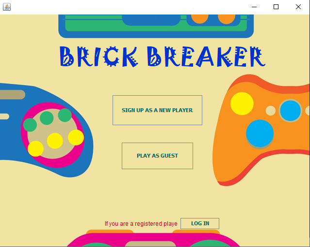
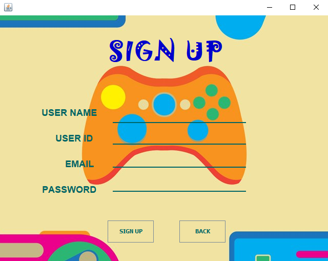
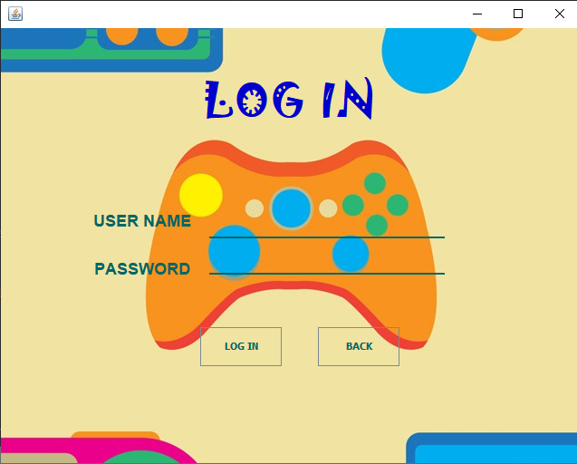
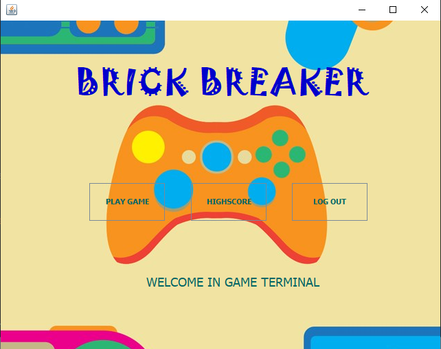
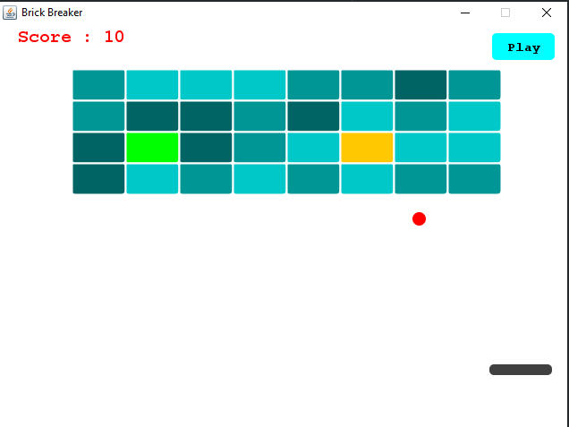
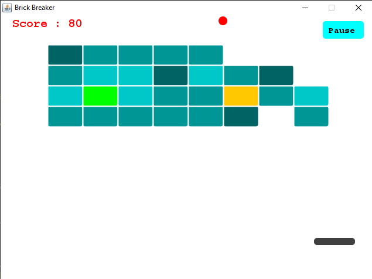
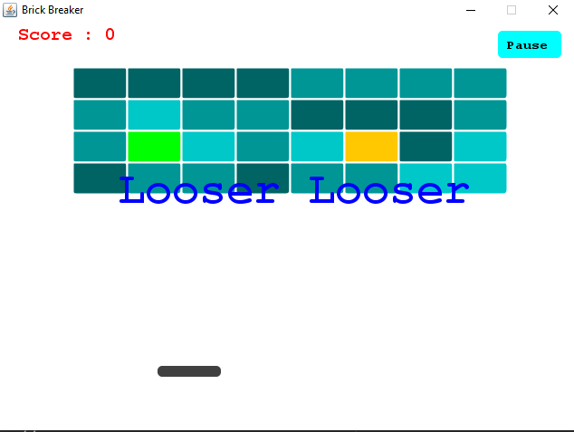
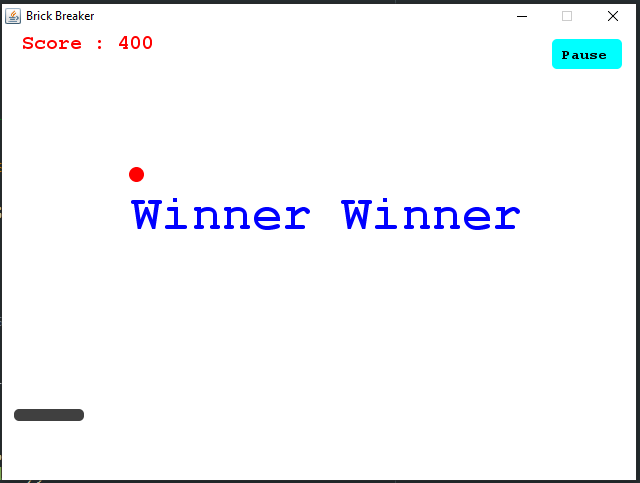
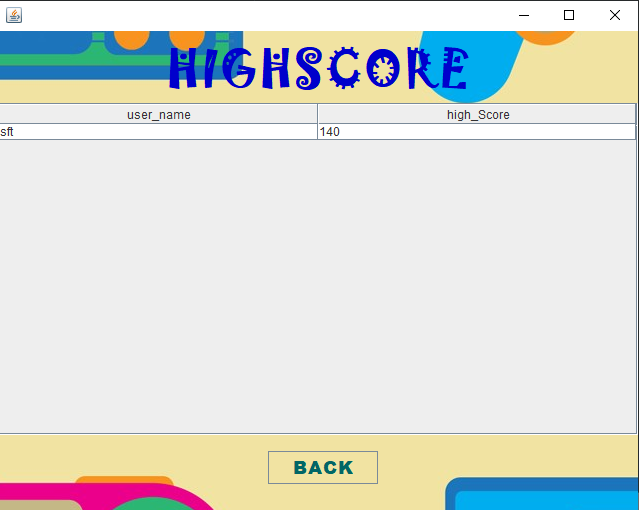

# Brick-Breaker-Game

___
## Introduction
This is a game project for my "System Analysis And Design" Course.
It's build for entertainment and expand my programming knowledge.

___

## Technologies
- Java 12 or 14
- MSSQL-2014 12.0.2269.0
- Design Pattern
	- Factory Method
	- Singleton
	- Facade

___
## Launch

- For run this project need to clone this repository in local machine.
- Guest mode is usable without any modification. 
- For using feature like sign-in and sign-up user need to connect a database to the source code.
	In the source folder database file is included in database folder. User need to run it in MSSQL and connect it with the source code

___
## Brick-Breaker
### Main-Panel

### Sign-Up Window

### Sign-In / Log-In Window

### Menu 

### Game-Play Window

### In-Playing_Mode

### Lose the Match

### Win the Match

### Save High Score

___

## Features
- Sign-Up
- Log-In
- Guest Mode
- Play/Pause
- Highscore ![Only for registered player]
___

## Sources
This tutorial series assist me a lot.
! [Joel Rogness](https://www.youtube.com/watch?v=Qc_OlE1Xn38&list=PLn6h3KPOiM-ErYSmMH1ULtyKTE765d0V3)

### This project is totally open. Anyone can use it for their work. :-)
